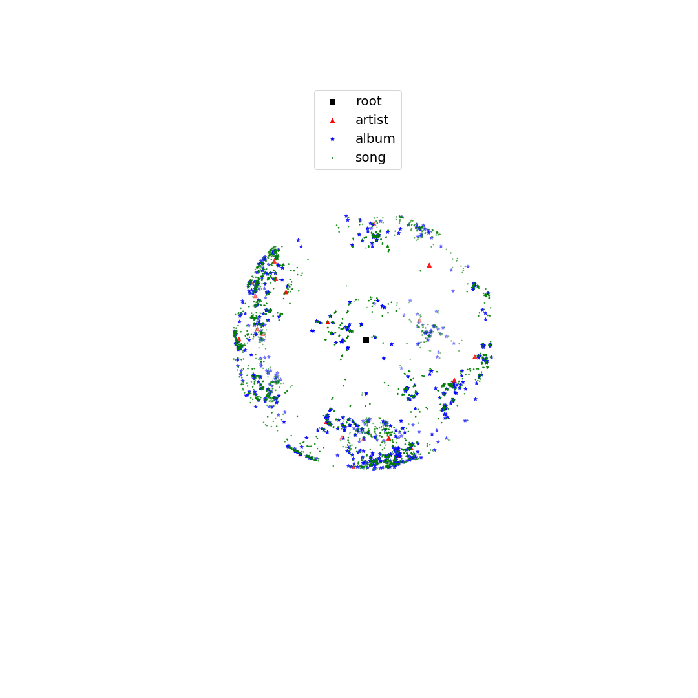

# Hyppye, a Python Package by Factored
Hyperbolic embeddings repository - Owned and developed by Factored AI

## Installation guide
* git clone git@github.com:lacunafellow/hyppye.git hyppye
* cd hyppye
* pip install --user .

## Usage guide:
**Example: create 3-dimensional embeddings from music_info.edges and save to embedding_result.txt**

```hyppye -i music_info.edges -o embedding_result.txt --dim 3```

Parameters ```--input``` and ```--output``` are
always required, if not provided, a help menu wil be shown.

Hyppye API is global executable. For more help on the available options, please run:

```hyppye --help```

## Parameters
* Parameter ```--input``` is a mandatory parameter that will receive the path of the input file. The input file may be an edge list separated by spaces (see ```music_info.edges``` on ```example``` directory). If this is the case, run as follows:

    ```hyppye --input example/music_info.edges --output embedding_result.txt --dim 3```


* The other kind of file that ```--dataset``` parameter allows is a csv file separated by tabs containing a graph that will be converted into a tree and then, an edge list and a hash map will be generated as a tab separated file. If this is the case, run as follows:

    ```hyppye --input example/music_info.txt --output embedding_result.txt --dim 3```

* Parameter ```-d``` (```--dim```) allows to choose the dimensions of the embedding. Default value is 3. Embeddings are **not** available for dimensions lower than 3. For an
embedding with 7 dimensions, use:

    ```hyppye --input music_info.edges --output embedding_result.txt --dim 7```


* Parameter ```-p``` (```--precision```) allows to choose the precision (in bits) used to compute the overall mathematical operations. Default precision is 256 bits. In order to use another precision, for example 128 bits, run:

    ```hyppye --input music_info.edges --output embedding_result.txt --dim 3 --precision 128```


* Parameter ```-p``` (```--precision```) allows to choose the precision (in bits) used to compute the overall mathematical operations. Default precision is 256 bits. In order to use another precision, for example 128 bits, run:

    ```hyppye --input music_info.edges --output embedding_result.txt --dim 3 --precision 128```


* Parameter ```-e``` (```--eps```) allows to choose the value of epsilon to compute the corresponding scaling factor in the worst-case distortion case. For more information on the scaling factor and the parameter epsilon, please refer to [Representation Tradeoffs for Hyperbolic Embeddings](https://arxiv.org/pdf/1804.03329.pdf). Default value of epsilon is 0.1. For a different value, for example 0.5, run:

    ```hyppye --input music_info.edges --output embedding_result.txt --dim 3 --eps 0.5```

* Parameter ```-c``` (```--use_codes```) if used, allows algorithm to use code theory to choose the position of the children nodes with respect to its parent. If not used, a uniform sampling along an hypersphere of dimension given by parameter ```--dim``` will be used. For use this parameter, run

    ```hyppye --input music_info.edges --output embedding_result.txt --dim 3 --eps 0.5```

* Parameter ```-v``` (```--verbose```) allows verbosity for a value different of 0. Default value is 0, i.e., no verbosity.

* Parameter ```-r``` (```--results```) will allow to see statistics and metrics such as the Mean Average Precision (MAP), average distortion and worst-case distortion. Run with

    ```hyppye --input music_info.edges --output embedding_result.txt --dim 3 --results```


* Parameter ```-s``` (```--sample```) will allow to sample a certain number of nodes in the graph to compute the sample instead of use the complete graph. This is an optional parameter with no default. Run as

    ```hyppye --input music_info.edges --output embedding_result.txt --dim 3 --sample 100```

## Results

Using a three dimensional embedding will give the following results.


